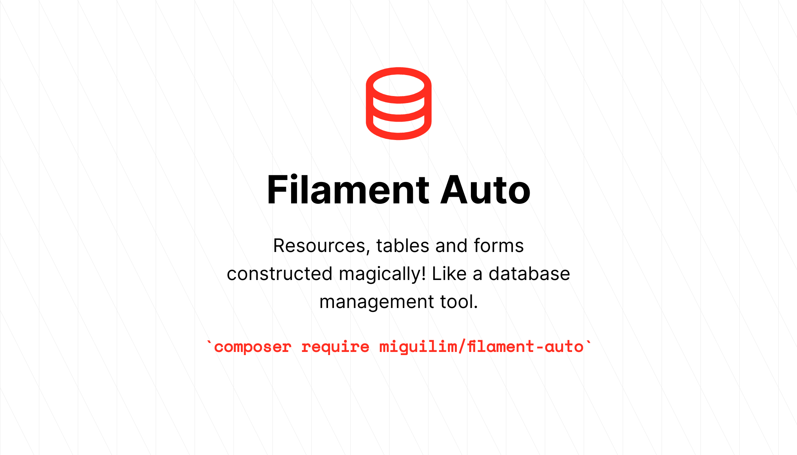

# Filament Auto Panel

[](https://packagist.org/packages/miguilim/filament-auto-panel)
[](https://packagist.org/packages/miguilim/filament-auto-panel)

Construct your Filament panel Resources and Relation Managers at execution time like magic. 
This package provide custom Resources and Relation Managers classes that mounts it table, create, view 
and edit pages at execution time by scanning the database current table schema while still giving you
the freedom to create actions, widgets and various customizations to your panel.

> [!IMPORTANT]
> This package is intended for admin panels, similar to how Laravel Nova works + everything auto-generated. You can also think it as a database management tool. If you feels you need a more customized resource workflow, re-consider to not use this package.

## Contents

- [Installation](#installation)
- [Usage](#usage)
  - [Soft Deletes](#soft-deletes)
  - [Primary Key](#primary-key)
  - [Relationship Linking](#relationship-linking)
  - [Intrusive Mode](#intrusive-mode)
  - [Default Pages](#default-pages)
  - [Default Actions](#default-actions)
  - [Default Sorting](#default-sorting)
- [Auto Resource](#auto-resource)
- [Auto Relation Manager](#auto-relation-manager)
- [Auto Action](#auto-action)
- [Enum Dictionary](#enum-dictionary)
- [Visible Columns](#visible-columns)
- [Searchable Columns](#searchable-columns)
- [Overwrite Columns](#overwrite-columns)
- [Widgets](#widgets)
- [Extra Pages](#extra-pages)
- [License](#license)

## Installation

You can install the package via composer:

```sh
composer require miguilim/filament-auto-panel
```

## Usage

Before getting started with the package, you must know some behaviors that the table schema reader have. 
The package takes into consideration your actual table schema in the database and not your migration file.
However, it is extremely important to use the correct fields in the migration in order to generate the correct columns.

An example of that is when you use the `boolean()` column method, Laravel will generate a `tinyint(1)` table column. This
specific column type and length will be used by Filament Auto Panel to detect its a boolean column. If you use the `tinyInteger()`
method, it will generate a `tinyint(4)` table column, and therefore will be identified as a numeric column, even if in its context 
it is being used as a boolean.

> [!NOTE]
> You can overwrite this auto-detection behavior by setting the cast for the column in your model class.

#### Soft Deletes

The package detects if the table has soft deletes or not by checking if it has the `SoftDeletes` trait, 
by checking if `getDeletedAtColumn` method exists in the model. If soft deletes is detected, it will append the `TrashedFilter` to the table filters.

#### Primary Key

Filament Auto Panel tries to detect the primary key by calling the `getKeyName()` method from the resource / relation manager model. The primary key
is searchable by default and it will also be copyable in table and infolist view.

#### Relationship Linking

The package tries to link any columns that ends with `_id` with a belongsTo relationship. It sets a searchable `Select` for create/edit actions, and an URL
linking to the respective resource in table and infolists (if the resource exists).

> [!NOTE]
> This linking currently do not support morphsTo detection. PRs are welcome!

#### Intrusive Mode

Auto Resources and Auto Relation Managers have the intrusive mode by default. When this mode is activated, the create and edit actions will not respect
the `$fillable` and `$hidden` model attributes. If you would like to disable this behavior, you can set `protected static bool $intrusive = false;` in your
resource or relation manager class.

#### Default Pages

By default, the Auto Resource have a list and view pages. The create and edit record is available as a modal action in the list and view pages respectively.

#### Default Actions

By default, Auto Resource appends the following default actions:

- Bulk Actions: `DeleteBulkAction or RestoreBulkAction, ForceDeleteBulkAction`
- Table Actions: `ViewAction or RestoreAction`
- List Page Actions: `CreateAction`
- View Page Actions: `EditAction, DeleteAction or RestoreAction, ForceDeleteAction`

and Auto Relation Manager appends the following default actions:

- Bulk Actions: `DeleteBulkAction or RestoreBulkAction, ForceDeleteBulkAction`
- Table Actions: `ViewAction, EditAction or RestoreAction`
- Header Actions: `CreateAction`

#### Default Sorting

By default, the Auto Resource and Auto Relation Manager tries to set the table default sort for the following columns, 
in priority order respectively: `primary key (only if incremented)`, `created_at (if exists)`, `updated_at (if exists)`.

> [!NOTE]
> You can customize the defaultSort() of your table (and any other method) by extending the `table(Table $table)` and use `parent::table($table)->defaultSort(...)`.

## Auto Resource

You can get started by creating your first Auto Resource using the following command:

```sh
php artisan make:filament-auto-resource
```

This command creates the Auto Resource class for you, just as the default filament command. However, it uses the `AutoResource` class instead.
You don't need to list anything now, **you can just access the resource page and see the magic!**

## Auto Relation Manager

Auto Relation Manager construct a table containing the all relationship model columns, excluding the related id or morph.
You can generate your Auto Relation Manager using the following command:

```sh
php artisan make:filament-auto-relation-manager
```

This command creates the Auto Relation Manager for you and you must list it in the `getRelations()` method of your resource.
However, sometimes you may want something more handier. You can create a relation manager inside your resource using the `RelationManagerMounter`.
See the following example of how it works:

```php
use Miguilim\FilamentAutoPanel\Mounters\RelationManagerMounter;

public static function getRelations(): array
{
    return [
        RelationManagerMounter::make(
            resource: static::class,
            relation: 'userBans',
            recordTitleAttribute: 'Bans',
            visibleColumns: ['reason', 'created_at'],
        ),
    ];
}
```

## Auto Action

The Auto Resource and Auto Relation Manager provides a `getActions()` method, however you cannot use the default Filament action on it. 

Instead, you must use the `AutoAction` class. This action type have same methods as Filament Actions, however it provide new methods to 
set where the action will be shown. This is needed since there is only this array for all resource action positions.

The resource `action` closure always receive a collection of models. See how it works in the example below:

```php
use Miguilim\FilamentAutoPanel\AutoAction;
use Illuminate\Database\Eloquent\Collection;

public static function getActions(): array
{
    return [
        AutoAction::make('refund')
            ->label('Refund')
            ->icon('heroicon-o-arrow-path')
            ->color('danger')
            ->action(fn (Collection $records) => $records->each->refund())
            ->showOnTable()
            ->showOnViewPage(),
    ];
}
``` 

> [!NOTE]
> By default the auto action are not shown anywhere, so you must set at least one of the following methods: `showOnTable()`, `showOnBulkAction()` or `showOnViewPage()`.

## Enum Dictionary

Enum dictionary is a feature available to help you formatting a value from a column for your resource. This feature sets a `badge()` in table and infolist, 
and use a `Select` in the form with the values you set. You can use it in the following way:

```php
protected static array $enumDictionary = [
    'type' => [
        0 => 'Default',
        1 => 'Administrator',
    ]
];
```

You may customize the badge colors with the following syntax:

```php
protected static array $enumDictionary = [
    'type' => [
        0 => ['Default', 'blue'],
        1 => ['Administrator', 'red'],
    ]
];
```

## Visible Columns

By default all columns are shown in the Auto Resource or Auto Relation Manager table. You can customize the columns visibility using:

```php
protected static array $visibleColumns = [
    'name', 'email', 'created_at'
];
```

This feature only sets the column default visibility in the top-right menu of your table. You can enable/disable any column visibility at any time using the panel.

> [!NOTE]
> You cannot customize form or infolist columns visibility.

## Searchable Columns

You can set searchable columns for your Auto Resource or Auto Relation Manager using:

```php
protected static array $searchableColumns = [
    'name'  => 'global',
    'email' => 'global',
];
```

You have the following searchable options to use: `global`, `individual` or `both`.

## Overwrite Columns

Sometimes you may want to customize the resource columns entirely, you can overwrite the table column, form field or infolist entry with the `getColumnsOverwrite` method:

```php
use Filament\Tables\Columns\ImageColumn;

public static function getColumnsOverwrite(): array
{
    return [
        'table' => [
            ImageColumn::make('profile_photo_url')
                ->label('Profile Photo')
        ],
        'form' => [
            //
        ],
        'infolist' => [
            //
        ],
    ];
}
```

> [!NOTE]
> You cannot append new columns using this method, only overwrite detected columns. The `make()` parameter name must be the same as the column name in the database.

## Widgets

You can set widgets to the `list` and `view` pages for your Auto Resource independently in the following way:

```php
public static function getHeaderWidgets(): array
{
    return [
        'list' => [
            MyCoolStatsWidget::class,
        ],
        'view' => [
            //
        ],
    ];
}

public static function getFooterWidgets(): array
{
    return [
        'list' => [
            //
        ],
        'view' => [
            //
        ],
    ];
}
```

## Extra Pages

You can append extra pages to your Auto Resource using the `getExtraPages` method:

```php
public static function getExtraPages(): array
{
    return [
        MyCustomResourcePage::route('/custom-path'),
    ];
}
```

## License

Filament Auto Panel is open-sourced software licensed under the [MIT license](LICENSE).